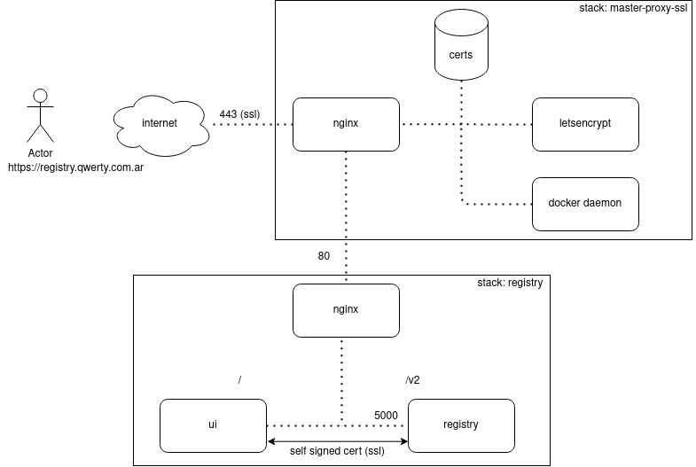

# Local docker registry with Lets Encrypt SSL certificate

This solution is based on jwindler containers for SSL certificates automation and docker image registry. Registry stack works within docker swarm cluster together with http-proxy stack of this repository.

**Content**
- [Diagram](#diagram)
- [Considerations](#considerations)
- [References](#references)

### Diagram

### Considerations
Communication between ui and registry is established using ssl with self signed certificates. This should be generated again once its validation time is over. See second link in References to generate that certificate again.

Headers in proxy.conf should be commented as explained in the issue 970 of the third link in references.

### References

- https://github.com/pablokbs/peladonerd/tree/master/docker/10
- https://medium.com/@ifeanyiigili/how-to-setup-a-private-docker-registry-with-a-self-sign-certificate-43a7407a1613
- https://github.com/distribution/distribution/issues/970
